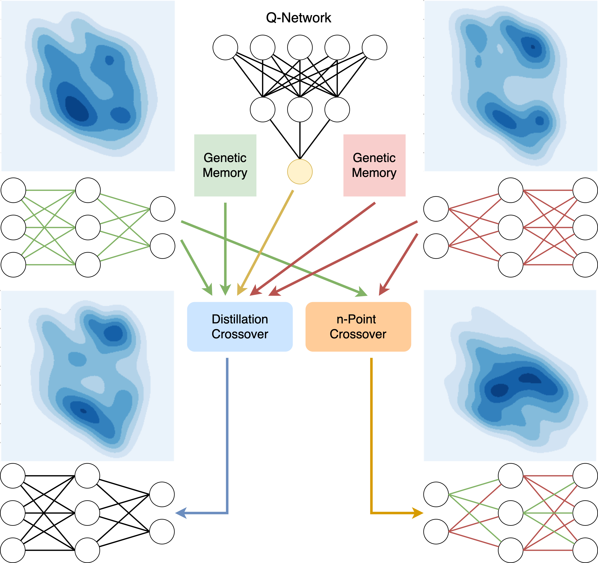
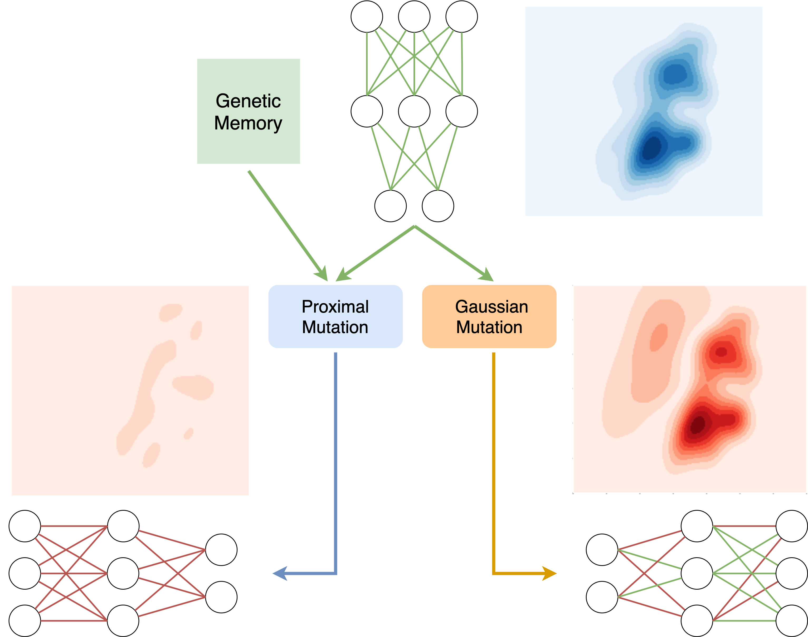

# Proximal Distilled Evolutionary Reinforcement Learning
Official code for the AAAI 2020 paper "Proximal Distilled Evolutionary Reinforcement Learning". 

 


#### To Run PDERL #### 

First, you will have to install all the dependencies by running ```pip install -r requirements.txt```.
For installing MuJoCo, follow the instructions on the [official webpage](https://github.com/openai/mujoco-py.). 

To run PDERL with proximal mutations and distillation-based crossover use:

```bash
python run_pderl.py -env $ENV_NAME$ -distil -proximal_mut -mut_mag=$MUT_MAG$ -logidr=$LOG_DIR$ -seed=$SEED$
```

#### ENVS TESTED #### 

'Hopper-v2' \
'HalfCheetah-v2' \
'Swimmer-v2' \
'Ant-v2' \
'Walker2d-v2' 

#### CREDITS ####

Our code is largely based on the [code of Khadka and Tumer](https://github.com/ShawK91/erl_paper_nips18) and we would 
like to thank them for making their code publicly available. The proximal mutations code is also relying on 
the [safe mutations code](https://github.com/uber-research/safemutations) of Lehman et al. from Uber Research.